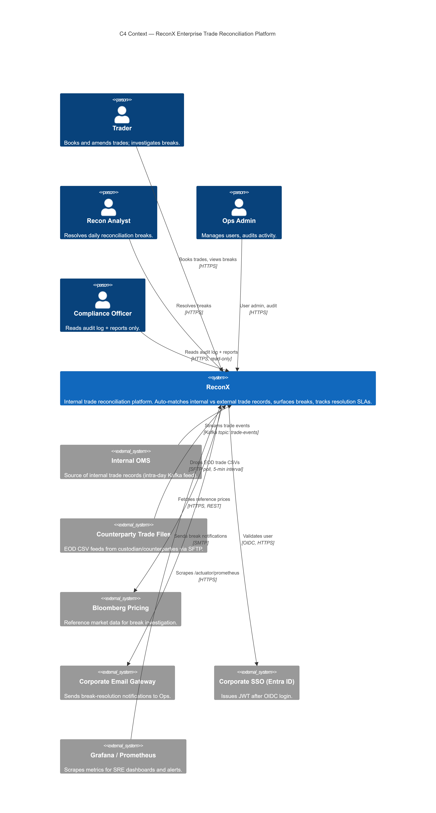
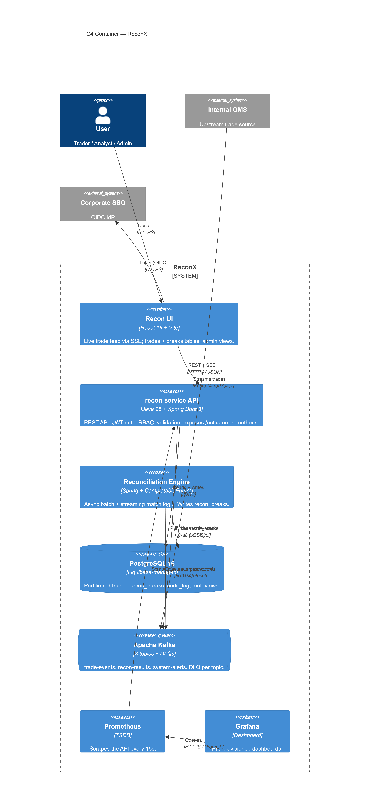
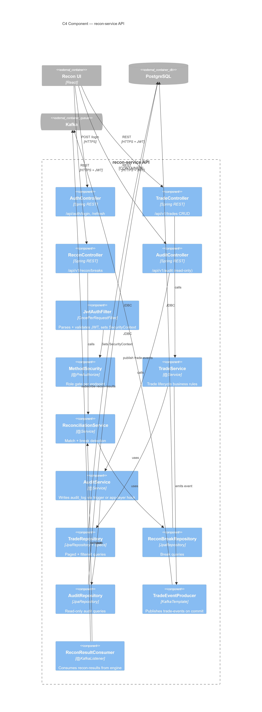
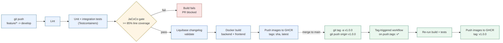
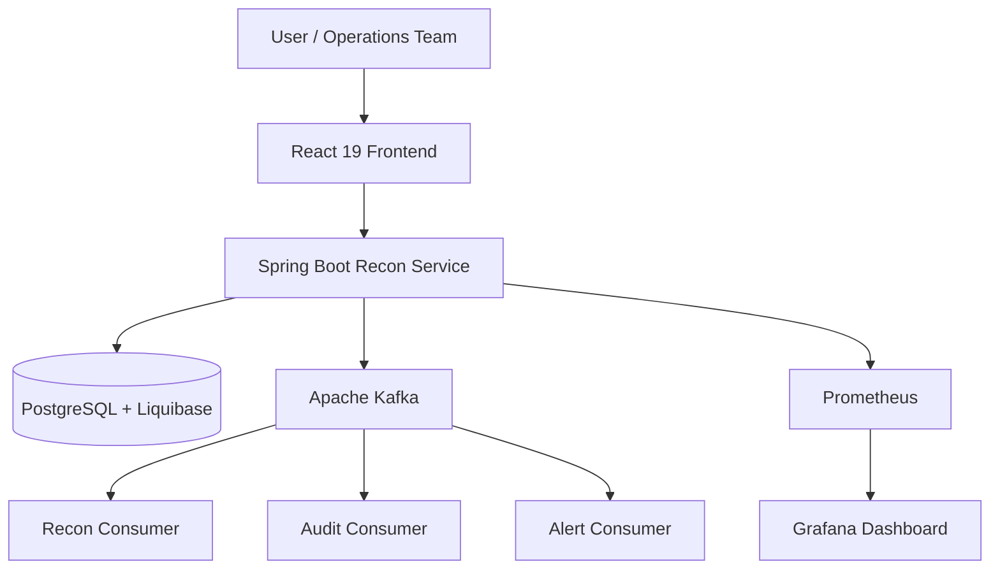
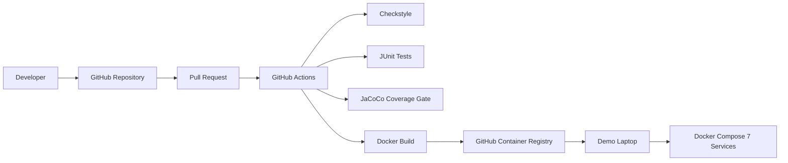

# ReconX — Enterprise Trade Reconciliation Platform

Near-production-grade trade reconciliation platform built for the Deutsche
Bank TDI 2026 Advanced Track. Ops teams use it (in concept) to detect and
resolve mismatches between internal trade records and external
counterparty/custodian feeds in near-real-time — Java 25 / Spring Boot 3
backend, React 19 frontend, Kafka event streaming, JWT-backed RBAC, and a
CI/CD pipeline that ships Docker images to GHCR.

## Quick start

```bash
echo $GHCR_PAT | docker login ghcr.io -u <gh-username> --password-stdin
docker compose pull
docker compose up -d
```

Open http://localhost:5173 and log in as `trader@db.com / trader123`.

## Table of contents

- [Architecture](#architecture)
- [Tech stack](#tech-stack)
- [API documentation](#api-documentation)
- [Monitoring](#monitoring)
- [Kafka topics](#kafka-topics)
- [Load test results](#load-test-results)
- [CI/CD pipeline](#cicd-pipeline)
- [Deploy runbook](#deploy-runbook)
- [Default credentials](#default-credentials)
- [Troubleshooting](#troubleshooting)
- [Final demo](#final-demo-day-10)
- [Team](#team)

## Architecture

Three C4 levels — Context, Container, Component. Full source lives in
[`db/diagrams/architecture.md`](db/diagrams/architecture.md) (ADV160).

### System Context



### Containers



### Components (recon-service API)



> Mermaid source for all three diagrams lives in
> [`db/diagrams/architecture.md`](db/diagrams/architecture.md). Regenerate
> these PNGs from there (mermaid.live export) if the architecture changes.

## Tech stack

- **Data:** PostgreSQL 16, Liquibase-managed migrations
- **Application:** Java 25, Spring Boot 3, Spring Security (JWT + RBAC)
- **Messaging:** Apache Kafka (3 topics + DLQ per topic)
- **UI:** React 19, Vite, SSE live feed
- **Observability:** Prometheus, Grafana

## API documentation

Swagger UI: `<backend-url>/swagger-ui.html`

> ⚠️ Placeholder — swap in the live URL once the backend is deployed for the
> demo (check the actual port in `application.yml` / `docker-compose.yml`
> before publishing this link).

## Monitoring

Prometheus scrapes `/actuator/prometheus` every 15s; Grafana dashboards are
pre-provisioned (request rate, latency, break count). Dashboard screenshots
were explicitly marked skip/optional by the instructor for this cohort, so
none are included here — this is a deliberate scope decision, not a missing
deliverable.

## Kafka topics

| Topic | Purpose |
|--------|---------|
| `trade-events` | Trades published by the API on commit |
| `recon-results` | Match/break results from the reconciliation engine |
| `system-alerts` | Operational alerts |
| DLQ (per topic) | Dead-letter queue for failed consumption |

## CI/CD pipeline



On every push to `develop`: lint → unit/integration tests (Testcontainers)
→ JaCoCo gate (≥85% line coverage) → Liquibase changelog validate → Docker
build (backend + frontend) → push to GHCR tagged `sha` and `latest`. A
failed coverage gate blocks the PR. Tagging `v1.0.0` on `main` triggers a
separate rebuild that pushes the same images tagged `v1.0.0`.

## Deploy runbook

```bash
echo $GHCR_PAT | docker login ghcr.io -u <gh-username> --password-stdin
docker compose pull
docker compose up -d
```

## Default credentials

> Dev profile only — never use these outside local/demo environments.

| Role | Username | Password |
|------|----------|----------|
| ADMIN | admin@db.com | admin123 |
| TRADER | trader@db.com | trader123 |
| VIEWER | viewer@db.com | viewer123 |
| RECON_ANALYST | recon@db.com | recon123 |

## Troubleshooting

- **Port conflicts:** Confirm nothing else is using ports 5173 (frontend), the backend port, 9090 (Prometheus), 3000 (Grafana), or 9000 (Kafdrop).
- **GHCR authentication failures:** Run `docker login ghcr.io` again using a Personal Access Token (PAT) with `read:packages` permission.
- **Kafka listener issues:** Verify that `advertised.listeners` matches how clients connect (host machine vs Docker network).

## Final demo (Day 10)

### Runtime architecture



The runtime architecture represents the ReconX application flow:

- React frontend communicates with Spring Boot REST APIs.
- Backend manages trades, reconciliation, security, and persistence.
- PostgreSQL stores application data through Liquibase migrations.
- Kafka handles asynchronous trade events.
- Consumers process reconciliation, audit, and alert workflows.
- Prometheus and Grafana provide monitoring and visualization.

### CI/CD + Deploy flow



The CI/CD pipeline validates every change through:

- Checkstyle static analysis
- Automated unit and integration tests
- JaCoCo coverage enforcement
- Docker image creation
- GitHub Container Registry (GHCR) publishing
- Demo laptop deployment

A 20-minute end-to-end walkthrough demonstrates the complete ReconX workflow from trade creation through reconciliation, monitoring, and deployment.

## Team

See [`docs/retrospective.md`](docs/retrospective.md) for the full team retrospective.

- Lead: Avani
- Backend: Vigna (API/controllers), Nandini (Kafka/reconciliation)
- Frontend: Shubhang
- DevOps/CI: Gaurav