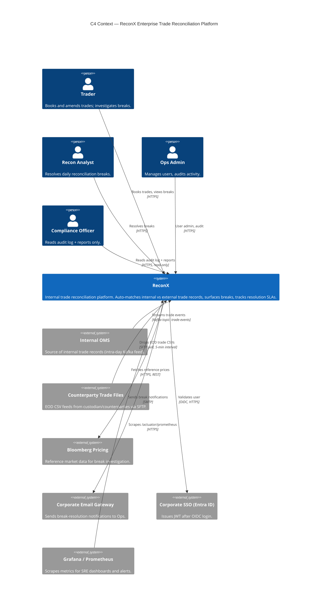
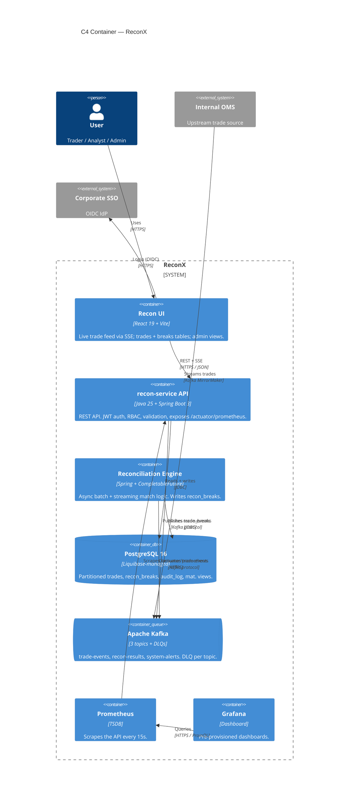
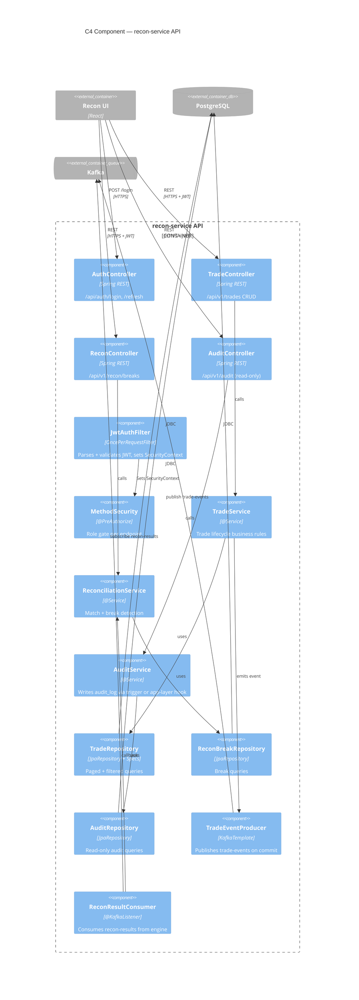

# ReconX — Architecture (C4 Model)

Deliverable for **TICKET-ADV160**. Consolidates the Context, Container, and
Component diagrams from ADV002–ADV004 into a single reference doc for the
README (ADV161) and demo deck (ADV162). Render any block at
https://mermaid.live to view or export as PNG/SVG.

---

## Level 1 — System Context

Who uses ReconX and what external systems it talks to.

**Verify:** exactly one `System(reconx, ...)` box; four `Person(...)` nodes; ~six `System_Ext(...)` nodes; every `Rel(...)` carries an intent + protocol label.

---

## Level 2 — Containers

Zooming into ReconX itself: the deployable pieces and how they talk.

**Verify:** exactly 7 boxes inside the boundary (React SPA, API, recon engine, Postgres, Kafka, Prometheus, Grafana); Postgres uses `ContainerDb`, Kafka uses `ContainerQueue`; User/OMS/SSO sit outside the boundary.

---

## Level 3 — Components (recon-service API)

Zooming into the API container itself.

**Verify:** title names the container being zoomed into; ~10–15 component boxes (4 controllers, `JwtAuthFilter`, `MethodSecurity`, 3 services, 3 repositories, 1 producer, 1 consumer); UI/Postgres/Kafka appear only as `*_Ext` at the edge; arrow flow reads UI → controllers → services → repositories/producer → DB/Kafka.

---

## CI/CD Pipeline

```mermaid
graph LR
    A["git push<br/>feature/* -> develop"] --> B["Lint"]
    B --> C["Unit + integration tests<br/>(Testcontainers)"]
    C --> D{"JaCoCo gate<br/>>= 85% line coverage"}
    D -- fail --> D1["Build fails<br/>PR blocked"]
    D -- pass --> E["Liquibase changelog<br/>validate"]
    E --> F["Docker build<br/>backend + frontend"]
    F --> G["Push images to GHCR<br/>tags: sha, latest"]

    H["git tag -a v1.0.0<br/>git push origin v1.0.0"] --> I["Tag-triggered workflow<br/>on.push.tags: v*"]
    I --> J["Re-run build + tests"]
    J --> K["Push images to GHCR<br/>tag: v1.0.0"]

    G -.merge to main.-> H

    classDef gate fill:#FFF6E5,stroke:#C77700,stroke-width:1px;
    classDef fail fill:#FBE4E4,stroke:#C0392B,stroke-width:1px;
    classDef stage fill:#EAF1FE,stroke:#1668E3,stroke-width:1px;
    classDef release fill:#E9F7EF,stroke:#1E8449,stroke-width:1px;

    class D gate;
    class D1 fail;
    class A,B,C,E,F,G stage;
    class H,I,J,K release;
```

**Verify:** the develop-branch path (lint → test → coverage gate →
Liquibase validate → Docker build → GHCR push) is separate from the
tag-triggered release path (tag push → re-build → GHCR push tagged
`v1.0.0`); the coverage gate has an explicit fail branch to a blocked PR.

---

## Source tickets

| Level | Ticket | Original file |
|-------|--------|----------------|
| Context | ADV002 | `db/diagrams/c4-context.md` |
| Container | ADV003 | `db/diagrams/c4-container.md` |
| Component | ADV004 | `db/diagrams/c4-component.md` |
| CI/CD | ADV160 | (this file, generated) |

This file (`db/diagrams/architecture.md`) is the ADV160 consolidation point —
the README (ADV161, Architecture + CI/CD sections) and demo deck (ADV162,
slides 3 and 7) embed rendered PNGs sourced from here
(`docs/images/c4-container.png`, `docs/images/cicd-pipeline.png`, etc.).
