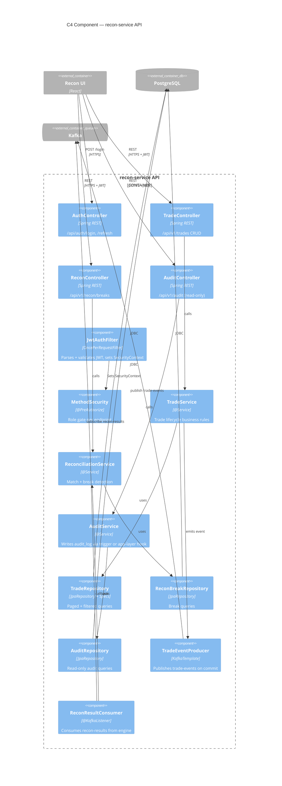

# C4 Component Diagram — recon-service API

> Deliverable for **TICKET-ADV004**. Place this file at `db/diagrams/c4-component.md` in the project repo.

## Verify

1. Paste the block above into https://mermaid.live and confirm it renders with no errors.
2. Confirm the title names the container being zoomed into (`recon-service API`).
3. Count the component boxes — should be roughly **10–15**: 4 controllers, `JwtAuthFilter`, `MethodSecurity`, 3 services, 3 repositories, 1 Kafka producer, 1 Kafka consumer.
4. Confirm UI, Postgres, and Kafka appear only as `Container_Ext` / `ContainerDb_Ext` / `ContainerQueue_Ext` at the edge — never as internal components.
5. Confirm the arrow flow reads UI → controllers → services → repositories/producer → DB/Kafka.
