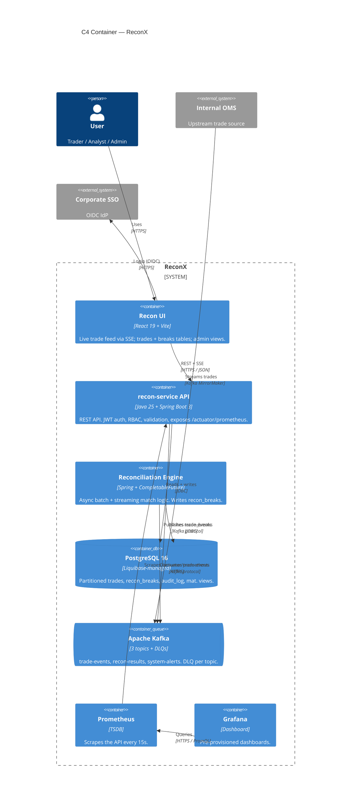

# C4 Container Diagram — ReconX

> Deliverable for **TICKET-ADV003**. Place this file at `db/diagrams/c4-container.md` in the project repo.

## Verify

1. Paste the block above into https://mermaid.live and confirm it renders with no errors.
2. Count the boxes inside `System_Boundary(reconxBoundary, ...)` — should be exactly **7**: React SPA, API, recon engine, Postgres, Kafka, Prometheus, Grafana.
3. Confirm Postgres uses `ContainerDb(...)` and Kafka uses `ContainerQueue(...)`.
4. Confirm the User, OMS, and SSO sit **outside** the boundary.
5. Confirm every `Rel(...)` arrow has both a protocol and an intent (e.g. `"REST + SSE", "HTTPS / JSON"`), not just "uses".
