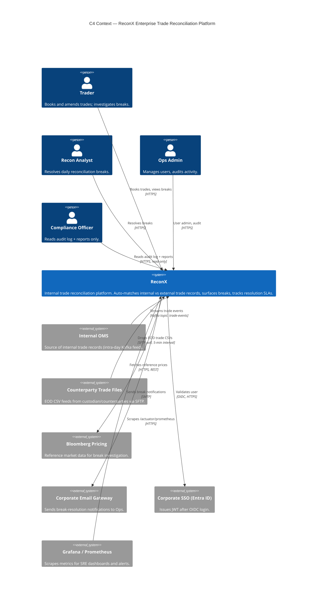

# C4 Context Diagram — ReconX

> Deliverable for **TICKET-ADV002**. Place this file at `db/diagrams/c4-context.md` in the project repo.

## Verify

1. Paste the block above into https://mermaid.live and confirm it renders with no parse errors.
2. Confirm there is exactly **one** `System(reconx, ...)` box — no internal containers or databases leaked in at this level.
3. Confirm there are **four** `Person(...)` nodes (Trader, Recon Analyst, Ops Admin, Compliance) and roughly **six** `System_Ext(...)` nodes (OMS, SFTP, Bloomberg, email, SSO, Grafana).
4. Confirm every `Rel(...)` arrow carries both an intent label and a protocol (HTTPS / Kafka / OIDC / SMTP) — not a bare "uses".
