# ReconX — Demo Deck (10 slides)

One purpose per slide. No slide is read aloud — the presenter speaks the
detail, the slide just anchors it. Cap: 3 bullets max per slide.

| # | Slide | Content (≤3 bullets) | Speaker note |
|---|-------|-----------------------|--------------|
| 1 | **Title** | ReconX — Enterprise Trade Reconciliation Platform · Team Avani, Vigna, Nandini, Shubhang, Gaurav · TDI 2026 Advanced Track | 10 s max, don't read the title aloud — say who you are and move on |
| 2 | **Problem** | • Ops teams reconcile thousands of trades/day manually • Mismatches surface late, cost real money • ReconX auto-detects breaks in near-real-time | Anchor in a concrete ops pain point, not an abstract one |
| 3 | **Architecture** | C4 Container diagram (from ADV160) — Recon UI, recon-service API, reconciliation engine, Postgres, Kafka, Prometheus/Grafana | Point at each box, name the tech, ~60 s total. Don't talk while moving the pointer |
| 4 | **Tech stack** | • Data: Postgres 16 + Liquibase • App: Java 25 / Spring Boot 3 • Messaging/UI/Obs: Kafka · React/Vite · Prometheus/Grafana | Group by layer — never a flat shopping list |
| 5 | **Live demo — login + post trade** | Screenshot fallback of the login → POST flow | Narrate live: "JWT issued, role-checked, validated, persisted" |
| 6 | **Live demo — Kafka + auto-recon** | Kafdrop screenshot + Grafana panel ticking | Show the trade hit the topic, then the recon metric move |
| 7 | **CI/CD** | CI/CD pipeline diagram — lint → test → 85% coverage gate → Liquibase validate → Docker build → GHCR push, plus the tag-triggered v1.0.0 release flow | Emphasize: "85% coverage gate, Liquibase validate, GHCR push" |
| 8 | **Monitoring** | Prometheus + Grafana setup; screenshots skipped for this cohort per instructor guidance | Say plainly that screenshots were out of scope, not missing |
| 9 | **Learnings** | One sentence each from Avani, Vigna, Nandini, Shubhang, Gaurav — hardest bug, biggest win, what you'd do differently | Honest beats polished |
| 10 | **Q&A** | "Questions?" + repo URL | Repo open in a browser tab, ready to navigate; lead routes questions |

## PR checklist before merge
- [x] Exactly 10 slides, matching this outline
- [x] No slide exceeds 3 bullet points
- [x] Architecture (slide 3) uses the actual ADV160 C4 Container render
- [x] CI/CD (slide 7) uses the actual pipeline diagram, not a placeholder
- [x] Monitoring (slide 8) — Grafana screenshots explicitly skipped per instructor guidance for this cohort; slide reflects that instead of a placeholder
- [x] Committed as `docs/demo-deck.pdf` (built from `docs/demo-deck.pptx` via pptxgenjs) so it survives a dead demo laptop

## Status
All 10 slides are done. Slide 3 uses the real ADV160 C4 Container diagram
(`docs/images/c4-container.png`). Slide 7 uses the CI/CD pipeline diagram
(`docs/images/cicd-pipeline.png`). Slide 8's Grafana screenshots were
explicitly marked skip by the instructor for this cohort, so the slide
states that as a scope note rather than showing screenshots or leaving a
"pending" placeholder. Slides 5–6 still show a fallback note since they
depend on a live-demo recording captured during rehearsal (ADV163), which
happens closer to the actual demo slot.

Rendered deck: `docs/demo-deck.pptx` and `docs/demo-deck.pdf`.

## Appendix — diagram sources

Slide 3 (Architecture) — see `db/diagrams/architecture.md` for the C4
Container Mermaid source.

Slide 7 (CI/CD) — paste into your slide tool of choice, or export a PNG
from https://mermaid.live and place it directly on slide 7.

```mermaid
graph LR
    A["git push<br/>feature/* -> develop"] --> B["Lint"]
    B --> C["Unit + integration tests<br/>(Testcontainers)"]
    C --> D{"JaCoCo gate<br/>>= 85% line coverage"}
    D -- fail --> D1["Build fails<br/>PR blocked"]
    D -- pass --> E["Liquibase changelog<br/>validate"]
    E --> F["Docker build<br/>backend + frontend"]
    F --> G["Push images to GHCR<br/>tags: sha, latest"]

    H["git tag -a v1.0.0<br/>git push origin v1.0.0"] --> I["Tag-triggered workflow<br/>on.push.tags: v*"]
    I --> J["Re-run build + tests"]
    J --> K["Push images to GHCR<br/>tag: v1.0.0"]

    G -.merge to main.-> H

    classDef gate fill:#FFF6E5,stroke:#C77700,stroke-width:1px;
    classDef fail fill:#FBE4E4,stroke:#C0392B,stroke-width:1px;
    classDef stage fill:#EAF1FE,stroke:#1668E3,stroke-width:1px;
    classDef release fill:#E9F7EF,stroke:#1E8449,stroke-width:1px;

    class D gate;
    class D1 fail;
    class A,B,C,E,F,G stage;
    class H,I,J,K release;
```

